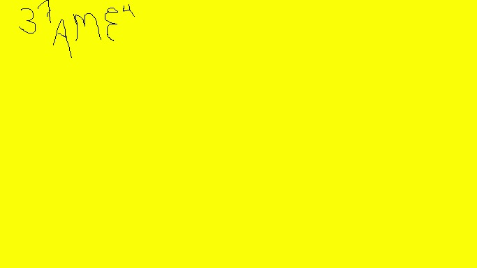
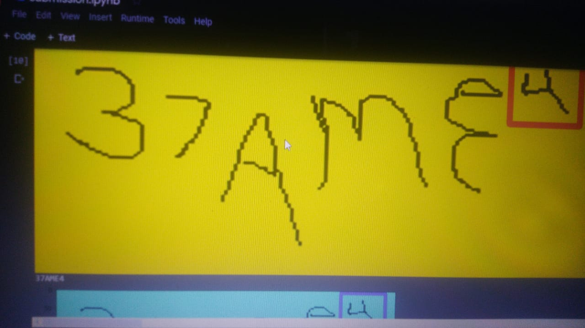

# Handwritten-Captcha-Recognition
## This is a repository having source code of Handwritten Captcha Recognition using EMNIST Dataset.
## _____________________________________________

I have trained this model using EMNIST Bymerge Dataset having 814,255 Images in total and 47 Classes. Some of the upper and lower case characters are identified as same to increase the accuracy of my model. This dataset has about 6.98 lakhs Training and 1.12 lakhs Testing Images. I got a Accuracy of 92% on my Training dataset and 90.76% on my Testing Dataset.
You can read more about EMNIST dataset here: https://arxiv.org/abs/1702.05373v1.

The files in this repo are: 
##### merge4.h5- Training Model as stated above
##### bymergetrained.ipynb and bymergetrained.py- Source Code of trained model. I have trained the model in Google Colaboratory.
##### evaluate.py- Source Code containing various functions to preprocess the image like Cropping, Thresholding, Contour Forming and prediction on multi character captcha. You can change them as you need.
##### submission.py- Code which imports evaluate.py to use it and make a working model.

I have commented the code so that it is easier to understand when and what happens.
In the folder test_image, I have tested certain images which I have provided for you to test. You can also add your images. Change their path in submission.py test function.

### Details of my Model:
1. It is a Sequential Model. Two Convolutional 2D Layers of 32 and 128 Neurons each. The first layer is of 32 neurons having a kernel of 5X5 and taking 2X2 strides with Relu Actiavtion. It is Input Layer.
The next is 128 neuron layer having 3X3 kernel and 1X1 Strides and Relu Activation.Each of the layers have a Pooling Layer.

2. A flattening and Dropout Layer with 0.3 dropout to prevent Overfitting of the model.

3. Another dense layer having 512 Neurons. It is a dense neural network having ReLu activation and dropout of 0.3 .

4. The final layer is a dense layer of the number of classes as neurons and Softmax Activation to get the final result. I got the best result with 30 Epochs. You can increase decrease to train it again to get a more good result. I had tried 35 also but it started overfitting more.

5. Adam Optimizer is te optimizer used and Cross Entropy function is the Cost Function.

### Features of my default code:

1. It can correctly identify some of the rotated characters. I haven't added any special algorithm for that.

2. Colored images having dark color in written text and lighter backgrounds can be identified correctly. Change threshold values or add a new Algorithm for that.
Characters written with Pens, Sketch Pens (Red, Blue, Black, Brown,etc. darker colors) are detected. 

3. Can Detect Captcha written at any point of the image. (Cropping Function Used).

An image showing the test:

See the answer below the shown image....

### To run the code: Open Terminal and type the listed commands.
Create a virtual anaconda environment. Use only Python 3.5 or 3.6 .
#### conda create -n <env name> python=3.6.1 
Activate Virtual Environment:
#### conda activate <env name>
Clone the Repo.
#### git clone https://github.com/adipro7/Handwritten-Captcha-Recognition.git
Go to the location of your cloned repo.
#### cd Handwritten-Captcha-Recognition
Install requirements:
#### pip install requirements.txt
Please note that I had install ROS in the same environment so some errors may arise due to this. Kindly remove all those files creating the errors from requirements.txt .

Run the files and model:
#### python submission.py merge4.h5
